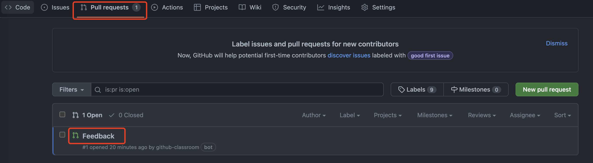

# 👋 Github Classroom 入门教程

请先阅读以下文档:

- [About Github Classroom](https://docs.github.com/en/education/manage-coursework-with-github-classroom/get-started-with-github-classroom/about-github-classroom)

## 关键概念

[Glossary](https://docs.github.com/en/education/manage-coursework-with-github-classroom/get-started-with-github-classroom/glossary)

### Classroom

嗯, 没错, 就是教室. 在教室里可以学各种各样的 Course (在 Github Classroom 中没有实际体现出这个概念), 通过 Assignment 检验 Course 的学习效果.

### Assignment

作业. 一个 Classroom 中可以布置多个作业. 一个作业也可以被多个 Classroom 复用.

### Roster

Classroom 级别, 通过 LMS 导入或手动管理的学生身份.

### Identifier

参与 Assignment 的唯一身份, 与 Github Account 关联.

## 课程内容

从 Student 的角度, 学习 Github Classroom 的基本使用方法.

### 参加 Assignment

通过作业邀请链接 [Invite Link](https://classroom.github.com/a/khy39RNF) 加入 Assignment 学习.


点击按钮之后, Github Classroom 会做一些初始化工作 (简单来说就是在特定的 Organization 下面, 基于 Template Repository 为你的 Github 账号创建一个 Repo, 并创建一些 Classroom 相关的 Github Action).


等待一小会儿再刷新这个页面, 如果初始化工作已完成, 页面会给出你的 Repo 链接. 比如我的 Repo 链接是 [github-classroom-tutorial-teckick](https://github.com/tannenbaumdev/github-classroom-tutorial-teckick)


注意不要修改这个 Repo 的 name, Github Classroom 对 Template Repo 和 User Repo 有着严格要求: `user_repo_name = {tmpl_repo_name}-{username}`

另外要注意的是, 一定要通过邀请链接创建仓库, 如果你自己通过 `Use this template`, 以上面的命名规范手动创建一个 Repo 也是不行的, Github Classroom 无法识别到.


至此你的 Assignment 就初始化完成了, 下面可以开始根据课程内容 (一般是 Repo 中的 README.md) 进行课程学习, 并最终完成课程作业.

### 完成 Assignment 作业

### 与 Reviewer 互动

如果你在课程学习中遇到了各种问题, 想向课程的 Reviewer 寻求帮助, 那么可以使用 Github Classroom 的 Feedback 功能.

> 前提: 该 Assignment 开启了 Feedback 功能.

在你的 Repo 的 `Pull requests` 列表中可以看到一个名为 `Feedback` 的, 这是 Github Classroom 自动创建的, 用于与 Reviewer 进行交流反馈:



通过 Comment 来和 Reviewer 进行交流, 如果最终完成了作业 (所有 Github Actions 都是 Pass 状态) 并且没有其他问题了, 可以自己把这个 Pull request 合并到 main 分支, 表示已完成本次作业.

## 课程作业

请通过 [Assignment 邀请链接](https://classroom.github.com/a/khy39RNF) 参加本课程学习, 并最终完成作业.

## 作业内容

### 完成学习总结

请在 Repo 的根路径下, 创建一个名为 `summary.md` 的文件, 要求文件格式如下:

```text
# Github Classroom 学习总结

{以下是你的学习笔记具体内容}
```

### Cargo

Cargo 是面向 Rust 语言的一个强大的包管理工具, 请参考 [安装文档](https://doc.rust-lang.org/cargo/getting-started/installation.html), 在本地安装好 Cargo.

安装完成后, 执行 `cargo init` 初始化, 并用 Git 提交生成的文件.

## 作业完成标准

1. 所有测例全部通过
2. Feedback 已合并到 `main` 分支
